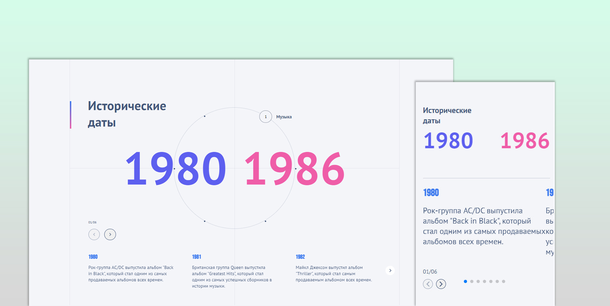

Страница реализована в соответствии с макетом (до 350px и более 351px)

Блок содержит информацию о временных отрезках, в каждом из которых существует несколько событий.
При переключении временных отрезков изменяются соответствующие числа и под ними показывается новый слайдер, который содержит подробную информацию по ключевым событиям на активном временном отрезке.

Возможно существование от 2 до 6 временных отрезков. Все интерактивные точки на окружности располагаются на одинаковом расстоянии друг от друга


* В проекте используется React.js и Typescript
* Стилизация с использованием SCSS (modules scss)
* Сборка проекта с помощью Webpack
* Слайдер реализован на Swiper
* Для реализации js-анимаций использован gsap


### Установка
Для установки и запуска проекта выполните следующие шаги:

1. Склонируйте репозиторий на локальную машину:

    ```bash
    git clone https://github.com/maestros123/only.git
    ```

2. Перейдите в директорию проекта:

    ```bash
    cd your_project
    ```

3. Установите зависимости:

    ```bash
    npm install
    ```

4. Запустите проект:

    ```bash
    npm start
    ```